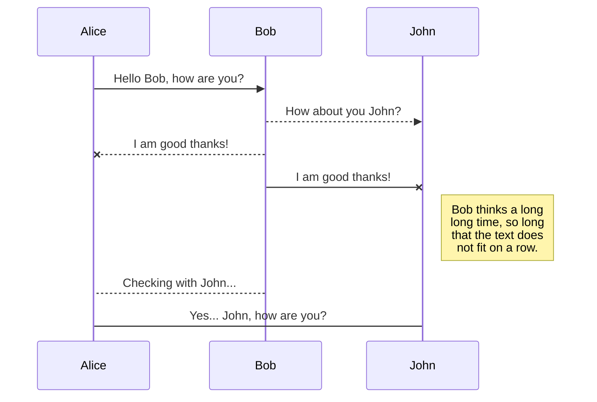
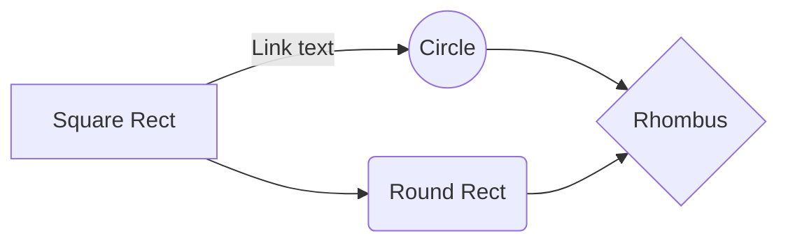

# Openwrt19*系列固件
## 关于此项目,这仅仅只是一个小小的开始;
### 不久将推出基于X86_64平台的Super 固件;
仅仅献给一位不在联系的朋友,***我什么都不为,也不想证明给你任何的什么,
只想挽回在你那台ios设备丢失的尊严***;这个计划筹备了很久,失败了很多次,
当然这终将会成功,

## 如何使用:
硬件设备,***NewWifi3无线路由器***一台;***普通无线路由器***一台;***RJ45_T568B千兆网线***一根;
(***声明:为了追求极致&稳定,内核默认去掉了无线芯片的驱动,以及USB3.0的驱动;***)
```ruby
1,重新刷入"BootLoader"请刷入主流的"Breed"这很简单,不介绍,
2,更改掉所有的MAC地址,记得备份好EEPROM;
3,刷入此固件;
4,Reboot and Enjoy;
```


# 特点:
## 主要功能:
```ruby
1,"Hello_world(集成了ss,ssr,v2ray,Trojan)主流工具,强烈推荐您使用Trojan;"
2,"Frp内网穿透客户端"
3,"应用过滤功能,现在'您可以保护您的孩子,以及您,免受来自游戏等危害,支持过滤主流的各种游戏
'某联盟,某吃鸡,某飞车,某...以及微信,QQ,爱奇艺,优酷,腾讯视频,,等等,您可以自己配置这一切,自由多么
的重要;"
4,BBR加速;
5,多线多播;
```
***稳定,简洁***
内置了最新版***Hello_world插件***帮你绕过来自大陆的网络审查,以及和此Kernel配套的***SDK***,升级插件将变得轻而易举,你无须编译整个固件;内置***Frp客户端***,随心随意的远程管理将在任何地方;

# 硬件连接:
## 这是迈向自由的重要步;


## UML diagrams

You can render UML diagrams using [Mermaid](https://mermaidjs.github.io/). For example, this will produce a sequence diagram:



And this will produce a flow chart:




# 💕特别感谢:💕

|        |             |            |
|--------|-------------|------------|
|💕开源💕|💕Lean大神💕 |💕左须之男💕|
|💕GooGle💕|💕Youtube💕 |💕Github💕 |


#### 特别的感谢
# 你
#### 以后就别去干流水线了,做点别的吧,祝你前途似锦;


# !!警告!!
此软件***仅仅只为学习,研究***,请勿作为商业用途出售贩卖以及非法传播,***由此造成的法律责任均和本人无关***;

### 信息不应该被收费;
### 网络不应该被封锁;
### 人人自由且平等;
# 不自由,毋宁死.
